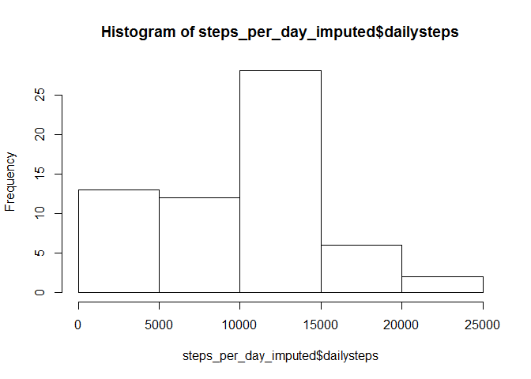

# Reproducible Research: Peer Assessment 1


## Loading and preprocessing the data

```r
unzip ("activity.zip")
rawdata <- read.csv("activity.csv")
```


## What is mean total number of steps taken per day?

### 1. Total number of steps taken per day

```r
steps_per_day_gp <- group_by(rawdata, date)
steps_per_day <- data.frame(summarize(steps_per_day_gp, dailysteps = sum(steps, na.rm = T)))
steps_per_day
```

```
##          date dailysteps
## 1  2012-10-01          0
## 2  2012-10-02        126
## 3  2012-10-03      11352
## 4  2012-10-04      12116
## 5  2012-10-05      13294
## 6  2012-10-06      15420
## 7  2012-10-07      11015
## 8  2012-10-08          0
## 9  2012-10-09      12811
## 10 2012-10-10       9900
## 11 2012-10-11      10304
## 12 2012-10-12      17382
## 13 2012-10-13      12426
## 14 2012-10-14      15098
## 15 2012-10-15      10139
## 16 2012-10-16      15084
## 17 2012-10-17      13452
## 18 2012-10-18      10056
## 19 2012-10-19      11829
## 20 2012-10-20      10395
## 21 2012-10-21       8821
## 22 2012-10-22      13460
## 23 2012-10-23       8918
## 24 2012-10-24       8355
## 25 2012-10-25       2492
## 26 2012-10-26       6778
## 27 2012-10-27      10119
## 28 2012-10-28      11458
## 29 2012-10-29       5018
## 30 2012-10-30       9819
## 31 2012-10-31      15414
## 32 2012-11-01          0
## 33 2012-11-02      10600
## 34 2012-11-03      10571
## 35 2012-11-04          0
## 36 2012-11-05      10439
## 37 2012-11-06       8334
## 38 2012-11-07      12883
## 39 2012-11-08       3219
## 40 2012-11-09          0
## 41 2012-11-10          0
## 42 2012-11-11      12608
## 43 2012-11-12      10765
## 44 2012-11-13       7336
## 45 2012-11-14          0
## 46 2012-11-15         41
## 47 2012-11-16       5441
## 48 2012-11-17      14339
## 49 2012-11-18      15110
## 50 2012-11-19       8841
## 51 2012-11-20       4472
## 52 2012-11-21      12787
## 53 2012-11-22      20427
## 54 2012-11-23      21194
## 55 2012-11-24      14478
## 56 2012-11-25      11834
## 57 2012-11-26      11162
## 58 2012-11-27      13646
## 59 2012-11-28      10183
## 60 2012-11-29       7047
## 61 2012-11-30          0
```

### 2. Histogram of total number of steps taken per day

```r
hist(steps_per_day$dailysteps)
```

<!-- -->

### 3. Mean and median of the total number of steps taken per day

```r
meansteps <- format(mean(steps_per_day$dailysteps),big.mark=",",scientific=FALSE)
mediansteps<- format(median(steps_per_day$dailysteps),big.mark=",",scientific=FALSE)
```

The mean and median of the total number of steps taken per day are 9,354.23 and 10,395 respectively

## What is the average daily activity pattern?

```r
steps_per_interval_grp <- group_by(rawdata, interval)
steps_per_interval <- data.frame(summarize(steps_per_interval_grp, averagesteps = mean(steps, na.rm =T)))
plot(steps_per_interval$interval,steps_per_interval$averagesteps, type ='l', xlab="5-minute interval", ylab="Average number of steps")
```

<!-- -->

```r
maxsteps <- steps_per_interval[which.max(steps_per_interval$averagesteps),1]
```

On average across all the days in the dataset, interval 835 contains the maximum number of steps.

## Imputing missing values

```r
missingvalues<-sum(is.na(rawdata[1]))
```
There are 2304 rows with NAs.


```r
steps_per_day_gp_imputed <- mutate(steps_per_day_gp, dailystepsmean = mean(steps, na.rm = T))
steps_per_day_gp_imputed$dailystepsmean[is.na(steps_per_day_gp_imputed$dailystepsmean)] <-0
steps_per_day_gp_imputed <- mutate(steps_per_day_gp_imputed, steps2 = steps)
steps_per_day_gp_imputed$dailystepsmean[is.na(steps_per_day_gp_imputed$dailystepsmean)] <-0
steps_per_day_gp_imputed <- mutate(steps_per_day_gp_imputed, steps2 = steps)
steps_per_day_gp_imputed$steps2[is.na(steps_per_day_gp_imputed$steps2)] <- steps_per_day_gp_imputed$dailystepsmean[is.na(steps_per_day_gp_imputed$steps2)]

steps_per_day_gp_imputed <- group_by(steps_per_day_gp_imputed, date)
steps_per_day_imputed <- data.frame(summarize(steps_per_day_gp_imputed, dailysteps = sum(steps2, na.rm = T)))


hist(steps_per_day_imputed$dailysteps)
```

<!-- -->


```r
meanstepsimputed <- format(mean(steps_per_day_imputed$dailysteps),big.mark=",",scientific=FALSE)
medianstepsimputed <- format(median(steps_per_day_imputed$dailysteps),big.mark=",",scientific=FALSE)
```
The mean and median of the total number of steps taken per day using imputed data are 9,354.23 and 10,395 respectively.

The values are exactly the SAME as the estimates computed above.

For this set of data, there is no impact imputing missing data.


## Are there differences in activity patterns between weekdays and weekends?

```r
steps_per_interval_grp$daytype <- ifelse(weekdays(as.Date(steps_per_interval_grp$date)) %in% c("Saturday", "Sunday"), "weekend", "weekday")
steps_per_interval_grp <- group_by(steps_per_interval_grp, interval, daytype)
steps_per_interval <- data.frame(summarize(steps_per_interval_grp, averagesteps = mean(steps, na.rm =T)))

xyplot(averagesteps ~ interval | daytype, data = steps_per_interval, type="l", cex = 1.5, xlab="Interval", ylab="Number of steps", layout=c(1,2))
```

<!-- -->
